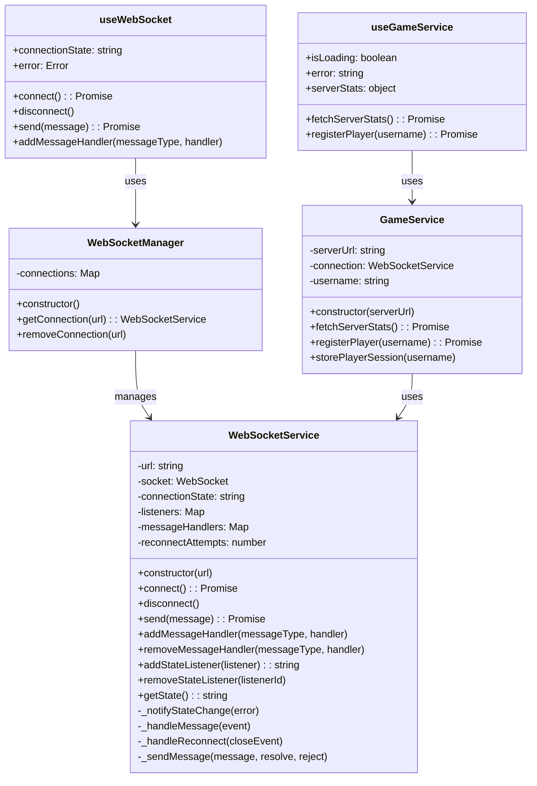

# Tanki Client

```mermaid
classDiagram
    class WebSocketService {
        -url: string
        -socket: WebSocket
        -connectionState: string
        -listeners: Map
        -messageHandlers: Map
        -reconnectAttempts: number
        +constructor(url)
        +connect(): Promise
        +disconnect()
        +send(message): Promise
        +addMessageHandler(messageType, handler)
        +removeMessageHandler(messageType, handler)
        +addStateListener(listener): string
        +removeStateListener(listenerId)
        +getState(): string
        -_notifyStateChange(error)
        -_handleMessage(event)
        -_handleReconnect(closeEvent)
        -_sendMessage(message, resolve, reject)
    }
    
    class WebSocketManager {
        -connections: Map
        +constructor()
        +getConnection(url): WebSocketService
        +removeConnection(url)
    }
    
    class GameService {
        -serverUrl: string
        -connection: WebSocketService
        -username: string
        +constructor(serverUrl)
        +fetchServerStats(): Promise
        +registerPlayer(username): Promise
        +storePlayerSession(username)
    }
    
    class useWebSocket {
        +connectionState: string
        +error: Error
        +connect(): Promise
        +disconnect()
        +send(message): Promise
        +addMessageHandler(messageType, handler)
    }
    
    class useGameService {
        +isLoading: boolean
        +error: string
        +serverStats: object
        +fetchServerStats(): Promise
        +registerPlayer(username): Promise
    }
    
    WebSocketManager --> WebSocketService : manages
    GameService --> WebSocketService : uses
    useWebSocket --> WebSocketManager : uses
    useGameService --> GameService : uses
```